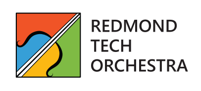
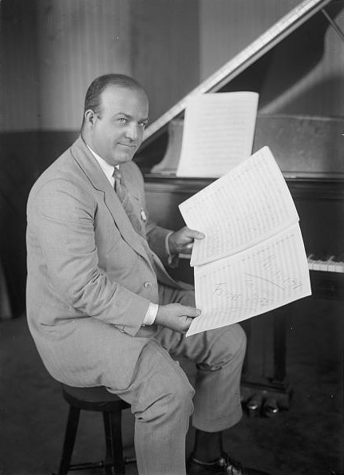
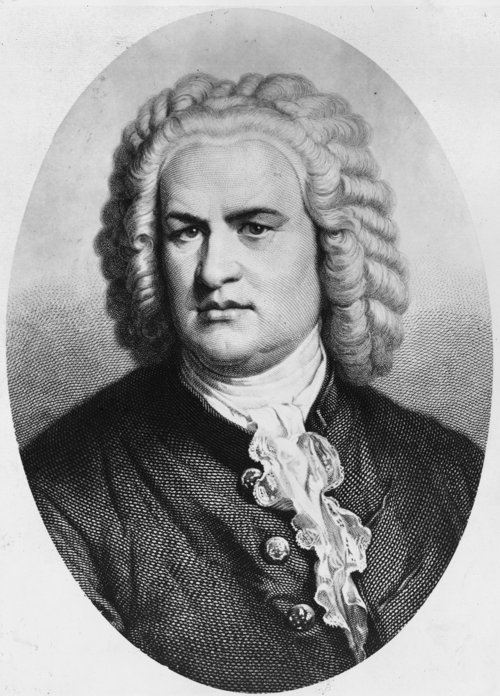
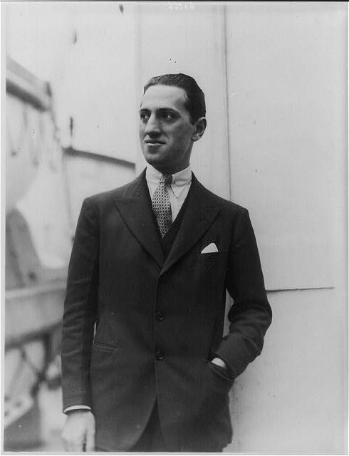
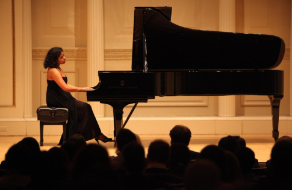

<h1 style="border-bottom: 0">Rhythm and Blues</h1>
<h2 style="margin-top: -25px">A Musical Journey</h2>  

July 18th, 2024  
Kirkland Performance Center

## Program

Ferde Grofé – Mississippi Suite (1926)  [14 min.]  
Aaron Copland – Buckaroo Holiday from “Rodeo” (1942) [8 min.]  
J.S. Bach – “Air” from Orchestral Suite No. 3 (1731) [5 min.]  
Red Velvet – Feel My Rhythm (2022) [4 min.]  
Red Velvet – Birthday (2022) [4 min.]

### *Intermission*

George Gershwin - Rhapsody in Blue (1924) [17 min.]  
George Gershwin - An American in Paris (1928) [18 min.]

## Program Notes

Welcome to the 2nd Redmond Technology Orchestra concert, *Rhythm & Blues: A Musical Journey*. Join us as we embark on a wonderful voyage, featuring pieces set across 3 continents and almost 300 years of music.

We begin our American tone journey at the mouth of the Mississippi River, from its headwaters of Minnesota to New Orleans. *Mississippi Suite* is a four-movement orchestral suite written by Ferde Grofé, an American composer born to German immigrants. *Father of the Waters* vividly portrays the origins of the mighty Mississippi River, tracing its birth to the streams of Minnesota and the lands historically inhabited by the Chippewa Indians. In *Huckleberry Finn*, inspired by Mark Twain's beloved novel, Grofé offers a whimsical and reflective section that captures the mischievous and adventurous spirit of the titular character. *Old Creole Days* weaves variations of a pentatonic melody around the strings, echoed by brass and woodwinds. It expands into a rich cultural tapestry of the American South, presenting an evocative interpretation of the spirituals once sung by slaves on the plantations. In the closing movement, *Mardi Gras* bursts with a lively, colorful celebration of Fat Tuesday in New Orleans, encapsulating the vibrant energy and joyous festivity with bright brass fanfares.

 
  
 

Prepare to saddle up with the explosive opening movement of Aaron Copland’s 1942 ballet suite *Rodeo.* Born to Jewish immigrants and a lifelong resident of New York City, Copland has established a defining archetype for the ‘American Sound,’ taking influence from a plethora of styles including jazz, western, folk, Cuban, Mexican, and more. *Buckaroo Holiday* features a lively scene where local cowhands are displaying their riding skills together at a corral. The protagonist Cowgirl, appearing with a mellow melodious section, tries her hand at the bucking bronco, whilst vying for the Head Wrangler’s attention. American folk songs *If He’d Be a Buckaroo by His Trade* and *Sis Joe* are incorporated into this movement, along with notable trombone and trumpet solos. If you listen closely, you can hear echoes of wild horses galloping at a rodeo.

 
  
 

In the next few songs we introduce sensational K-pop group Red Velvet. The original songs sample classical hits creating a union of classics and modern, interweaving their interpretations and new melodies atop famous pieces. 

Johann Sebastian Bach transports us to Baroque Italy with *Air*, the second movement of his Orchestral Suite No. 3 in D Major. Born to a large family of musicians, Bach was known to contemporaries as an excellent organist and harpsichordist and to us as one of the greatest composers of all time. Written in the early 1730s, the titular piece is reminiscent of Italian operatic arias for its song-like composition and for providing the wellspring of Bach’s lyricism. One of Bach's most recognizable pieces, the juxtaposition of the continuous walking bass and the interlacing melody among the high strings evokes a serene heartbeat.

 
  
 

*Feel My Rhythm* is an orchestral rendition of the lead single of the album ‘The ReVe Festival 2022 - Feel My Rhythm.’ Released on March 21, 2022, to commemorate the birth of the late Johann Sebastian Bach, the K-pop hit is a love letter to the Renaissance. It samples the quintessential period piece of *Air* coupled with the counterpoints heard in the chorus, and even the D♭ key of the song is reminisce of Baroque tuning. The orchestral adaptations for both Red Velvet songs were arranged by our conductor,  Peter Yang.

Red Velvet released another ReVe Festival album in November 2022 featuring *Birthday*, a dance-pop track that incorporates elements of R&B, trap, drum, and synth rhythms. Sampling *Rhapsody in Blue*, the song expresses themes of birthday wishes and 'making all of your dreams come true, giving yourself a day to remember.' The orchestral arrangement remains faithfully true to the original K-pop tune. The catchy melody is passed around the ensemble, beginning with the woodwinds and strings providing a forward moving bass accompaniment. The piece builds to a bombastic ‘bass drop,’ reflecting the original song, before pulling back to another woodwind-heavy refrain.

One of George Gershwin’s most recognizable compositions — many classical aficionados can identify the piece just by the opening clarinet glissando, *Rhapsody in Blue* marries elements of classical and jazz in this arrangement for solo piano and orchestra. Commissioned in 1924 for the concert: “An Experiment in Modern Music,” the idea for the piece boarded Gershwin’s mind during a train ride to Boston, where he had only five weeks to complete the work. The rhapsody premiered with roaring success with Gershwin performing the (slightly improvised) piano solo. Ferde Grofé entered the scene to help Gershwin with multiple orchestrations for the piece, including ones for jazz band, chamber orchestra, and full orchestra.

 
  
 

Viewed alongside Copland as one of the defining voices in American music, George Gershwin’s trademark combination of classical music with jazz, Broadway, and American popular song is widely celebrated today. Inspired by the time he spent vacationing in the French capital city, *An American in Paris* is Gershwin’s first tone poem and first symphony, premiered in 1928 by the New York Philharmonic. In a loose A B A’ format, the A section evokes the lively atmosphere of a bustling Parisian street, punctuated by distinct taxi horns (that Gershwin anecdotally purchased twenty of before settling on four with identifiable pitches). The use of taxi horns captures the essence of modernity and the atmosphere of any major city, transcending beyond being in Paris. In the B section, we experience a wafting sense of homesickness as the ambience of New York jazz clubs and syncopated rhythms permeate the air. During the blues theme, there is a subtle nod to Bach’s *Air* in the pizzicato bassline and heavy string make-up. Towards the end of the song, our dazed protagonist realizes they are in the wonderful city of love, and a refreshed, energetic Charleston blues theme dispels the heavy melancholy. As the recapitulation concludes, we joyfully relive our return to Paris, triumphant over the struggle with homesickness and renewed in spirit. In this “series of impressions musically expressed” (Gershwin), the various textures and colors of all the instruments in this symphonic poem is a wonderful showcase of the genius of Gershwin.

## Musician Roster

| Instrument | Musicians |
| --- | --- |
| 1st Violin | Rachel Keirouz (Concertmaster) Jerry He (Assistant Concertmaster) Mirabai Smooth (Associate Concertmaster) Jacqueline Cai Madeline Jacobitz Isabel Milewski Sophie Zhao |
| 2nd Violin | Brandon Chen (Principal)  Kayla Krieger (Assistant Principal)   Erica Choi  Riley Dyer Farrah Hasen Trevor Jones Kathryn Kuan Gabriel Mallari Isabella de Leon Amy Ouyang Rachael Tang  |
| Viola | Henry Wang (Principal) Anita Ambalavanan Ames Huang Lauren Kam Sunjana Kulkarni Eleanor Mengel Sean Park |
| Cello | Rodrigo Ramirez (Principal) Alaina Bossert Dorian Latchague Sabrina Ang |
| Bass | Tanya Lai (Principal) Adrian Pang |
| Flute/Piccolo | Jennifer Lee (Principal)  Nandhini Lakuduva\* (Assistant Principal) Alex Ayala\* (Piccolo Principal) Hannah Bang Elliot Barnette\* Yannie Li Stephanie Luck Yoona Oh Britania Rodriguez Reyez Kathy Smythe Martha Tran Yueh Tsao |
| Oboe | Jennifer Williams (Principal) Sandy Moon|
| Clarinet | Vicky Harp (Principal)  David Chen (Assistant Principal) Tom Glanz Renee Hsu Michael Taylor Moe Tsuboike Emily You |
| Bass Clarinet | Joanna Chu (Principal)  |
| Bassoon | Joshua Schnipke (Principal)  Emily Jin |
| Percussion | Matthew Kangas (Principal)   Alex Cabral   Bryan Reich  Enrique Saurez |
| Keys | Jada Campbell \* (Principal)|
| Trumpet |Sven Boemer (Principal) Abram Sanderson Ayush Vikram |
| Horn | Andrew Schuck (Principal)   Linda Brooking   Jose Carpio   Caeli Maclennan|
| Trombone | Cole Brooking (Principal) Kirsten Clemens (Assistant Principal) Conall Anderson Zach Halasz Johnny Leek |
| Bass Trombone | Stephen Smolen (Principal)   Torin Vermette |
| Tuba | Aaron Moore (Principal) |
| Saxophones | Ethan Wong \* (Principal)   Melanie Baker  Juan Pablo Maldonado Castro   Camilla Djamalov   Adithya Mukund \*   Tiffany Ou John Storgion Zichang Su  James Wilkinson\*

\* Doubling on multiple instruments or parts

## Soloist

### Jada Campbell

Jada Campbell is a distinguished concert pianist who has captivated audiences around the world with her profound musicality and technical brilliance. Known for her expressive interpretations and dynamic stage presence, Jada has established herself as a formidable artist in the classical music world.

Jada's solo performances have graced prestigious venues, including the 30th Annual LINKS Concert at the Kosiakoff Center in Laurel, Maryland, and the American Protégé International Piano Competition at Weill Recital Hall, Carnegie Hall in New York City.

 
  
 

A passionate chamber musician, Jada has performed in renowned festivals such as the Zodiac Music Festival in Valdeblore, France, and the Cremona International Music Festival in Italy. Her chamber music highlights include performances at the Chapelle du Verona in France, Cohen-Davidson Hall in Baltimore, and the Plaza de Corona in Cremona. Jada's orchestral experience is equally impressive, having served as an orchestral pianist with the Peabody Modern Orchestra and the Peabody Wind Ensemble.

A graduate of the Peabody Conservatory with a Bachelor of Music in Piano Performance, Jada studied under the esteemed Brian Ganz. Her academic and artistic prowess has been recognized through numerous awards, including 1st Place at the Florida State Concerto Competition and the American Fine Arts Federation “Golden Era” of Romantic Music Competition.

Jada also works as a product manager at Microsoft on Azure Communication Services. While not writing product specs or practicing, she’s passionate about tabletop RPGs, anime and gaming. She lives with her partner and two pets in Renton, WA.

## Looking Ahead

As the final notes fade into the night, we bid farewell to this enchanting evening of rhythm and blues. Through lasting K-pop melodies and jazzy rhythms, our journey has spanned from the southern and western corners of America to various European destinations and parts of Asia. Tonight, we celebrated classical themes incorporated with ragtime and blues in America, tapping into its raw energy as well as the heartfelt lyricism of the new (Red Velvet) and old (JS Bach). Please be on the lookout for our orchestra’s next concert in November, featuring the unearthly New World Symphony and some exciting chamber music. Stay tuned!

## Support Us

Follow us on Facebook and Instagram! Leave a Donation!
([PayPal](https://www.paypal.com/donate/?hosted_button_id=FMGNWMZECNGZE)) ([Venmo](https://www.venmo.com/u/redmondtechorchestra))  ([Facebook](https://www.facebook.com/profile.php?id=61557022596926))  ([Instagram](https://www.instagram.com/redmondtechorchestra))

